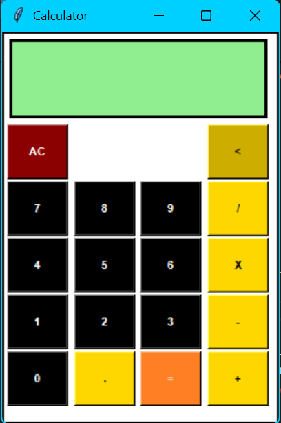

# Tkinter Calculator

A simple calculator app built using Python's Tkinter library. It provides a graphical interface to perform basic arithmetic operations: addition, subtraction, multiplication, and division.

This project is part of my [Python Mini Projects](../) collection.

---

## Features

- User-friendly GUI using Tkinter
- Buttons for digits (0-9), operators (+, −, ×, ÷)
- Clear (`AC`) , Backtrace (`<`) and equals (`=`) functionality
- Error handling for invalid operations (like division by zero)

---

### Requirements
- Python 3.x 
(Tkinter is included with standard Python installations.)

---

### Steps

```bash
git clone https://github.com/Triquetra003/python-mini-apps.git
cd python-mini-apps/Calculator
python calculator.py
```
---
## Demo


---
